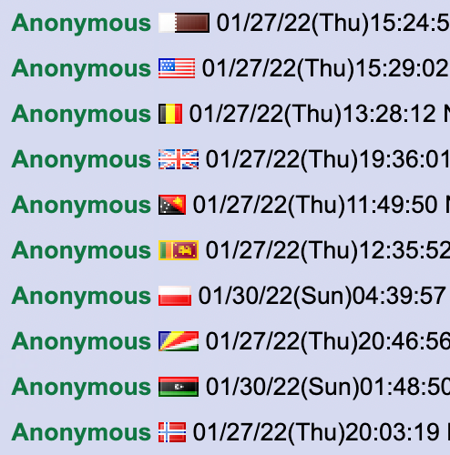

# True Flag Dimensions

Stylish theme / userscript that converts 4chan's 16x11px flag icons to their true dimensions. Also updates and improves many flags.

### Installing

- Install the Stylish browser extension: https://userstyles.org/
- Afterwards, install the True Flag Dimensions theme: https://userstyles.org/styles/228027/4chan-true-flag-dimensions

Alternatively, install as a userscript: https://github.com/shoal3/TrueFlagDimensions/raw/main/4chan-true-flag-dimensions.user.js. Script does not work with 4chanX.

### Issues

If flags suddenly misalign then manually update the theme in the Stylish extension or replace the userscript. If you dislike a certain flag, think a flag's dimensions are wrong or want to provide feedback, then make a post about it on /flag/ + /extraflags/ (on /int/) and I'll resolve it. There are some flags where I intentionally used the wrong dimensions (e.g. 21x11px instead of 22x11px) to properly center a symbol with odd width.

### Changelog

v1.3 - 19 Apr 2022: Improved Montenegro, France, Syria, Morocco, Germany, Saudi Arabia, Curacao, South Africa, Saint Barthelemy, Guadeloupe, South Sudan, Libya, Canada, UAE, Iraq, UK, Thailand, Costa Rica, Bangladesh, Gibraltar, USA, Kuwait, Jordan, Sudan, Palestine, Bosnia & Herzegovina, Trinidad & Tobago.

v1.2 - 16 Mar 2022: Replaced Antarctica flag. Redrew Gibraltar. Slightly modified Australia, New Zealand, Micronesia.

v1.1 - 11 Feb 2022: Cleaned up Sudan, Palestine, UAE, Jordan, Kuwait and Germany. Changed Honduras' colour from turquoise to light blue. Added flag for Antarctica. Fixed Marshall Islands width.
